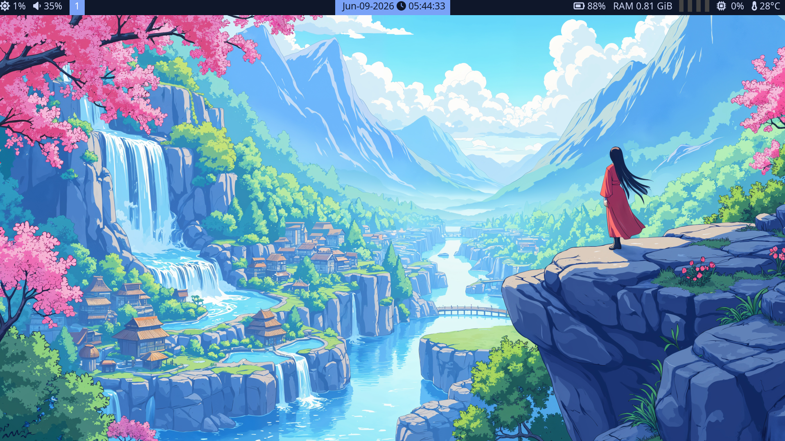
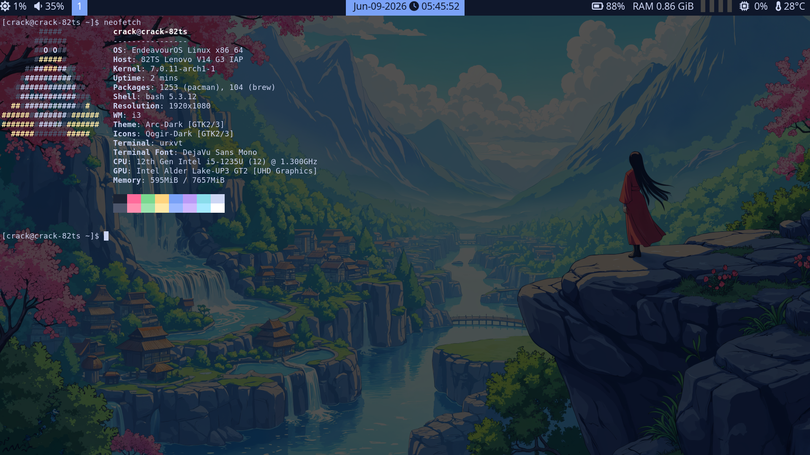

# i3 Dotfiles

A minimalist and productivity-focused i3wm setup for EndeavourOS.

## Memory Usage

Idle RAM usage:

~866 MB

## Preview



## System Information



## Tested On

- EndeavourOS
- i3wm
- X11
- Polybar
- Picom

## Features

* i3 Window Manager
* Polybar
* Picom compositor
* Tokyo Night inspired theme
* Vim-style navigation (hjkl)
* Scratchpad support
* Bluetooth manager shortcut
* Kali Linux VirtualBox launcher
* Lightweight setup (~900MB RAM idle)

## Applications

* URxvt
* Kitty
* Rofi
* Thunar
* Flameshot
* Blueman
* Spotify
* VS Code

## Documentation

- Keybindings → docs/keybindings.md
- Dependencies → docs/dependencies.md

## Installation

```bash
git clone https://github.com/azmaatam/i3-dotfiles.git
cd i3-dotfiles
chmod +x scripts/install.sh
./scripts/install.sh
```

## License

MIT License
